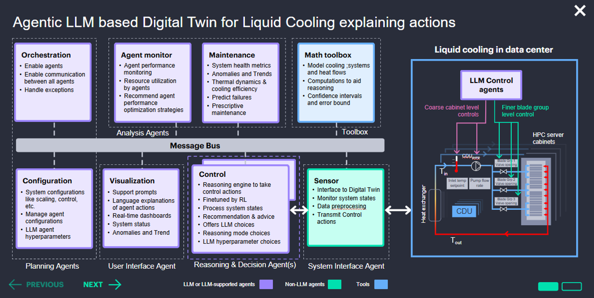

Agentic LLM-Based Digital Twin for Liquid Cooling
=================================================

This section describes a modular agent-based architecture enhanced with Large Language Models (LLMs) to enable **explainable control** in liquid-cooled data centers. The system is built on functional agents that communicate via a centralized **Message Bus**.

Agent Types
-----------

- **LLM/LLM-supported Agents (purple):** Handle reasoning, planning, and control decisions.
- **Non-LLM Agents (blue):** Handle system-specific monitoring, control, and interfacing.
- **Tools (green):** Provide analytics, modeling, and visualization.

Main Components
---------------

- **Orchestration:** Manages agent lifecycle, communication, and error handling.
- **Agent Monitor:** Tracks performance and suggests optimizations.
- **Maintenance:** Detects anomalies and enables predictive maintenance.
- **Math Toolbox:** Offers modeling tools, statistical reasoning, and uncertainty analysis.
- **Configuration:** Handles system parameters, logic, and hyperparameter tuning.
- **Visualization:** Supports explanations, dashboards, and trend displays.
- **Control:** Issues real-time actions, combines RL and LLM-based policies.
- **Sensor:** Interfaces with the physical system and digital twin.
- **LLM Control Agents:** Issue adaptive actions for cooling elements based on historical and real-time data.
- **Liquid Cooling System:** Uses a CDU and cabinet valves for precise thermal control, based on sensor feedback (T_in, T_out).

Validating Explainability
-------------------------
A critical component of this framework is ensuring that the LLM-generated explanations are not only coherent but also accurate and useful for human operators. To demonstrate this, we provide a series of concrete examples where RL agent actions are interpreted by an LLM. Each example is accompanied by a qualitative assessment from a data-center facilities expert, validating the LLM's reasoning and guidance.

.. toctree::
   :maxdepth: 3
   :caption: Agentic AI Topics

   LLM Agentic Playground <agentic2>
   LLM Control Comparison <agentic3>
   LLM Explanation and Guidance Evaluation <llm_evaluation>