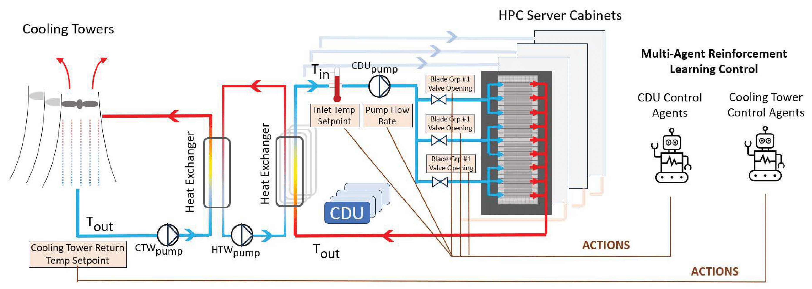

Sustain-LC Documentation
========================

Introduction
------------
Sustain-LC is a Gymnasium-compatible framework for simulating, modeling, and controlling liquid-cooled data center cooling systems using both rule-based and reinforcement-learning-based methods. This documentation covers:

- Installation instructions for setting up Sustain-LC.
- An overview of the liquid cooling architecture.
- Details of the JSON-to-Modelica modeling pipeline.
- The design of the Cooling Tower and Blade Group MDPs for RL-based control.

SustainLC Description
---------------------
First, we provide a high-level description of the Frontier Liquid Cooling system and how it has been augmented with blade-level cooling, coolant setpoint and flow-rate control, and Cooling Tower water setpoint control. This enables machine-learning–based temperature and power management. We then describe the modeling workflow and the RL control formulations implemented in Sustain-LC.

Frontier Liquid Cooling System for Machine Learning Applications
----------------------------------------------------------------
Below is the high-level architecture of the Frontier LC system. Server cabinets are grouped into blades, each cooled by a CDU–Rack Loop that extracts heat via a heat exchanger and pumps by adjusting coolant temperature and flow rate. Heat from 25 such CDU–Rack pairs is collected by a central Hot Water System (HTW) and rejected via the Cooling Tower (CT) Loop, which uses fans for forced-draft cooling through sensible and latent processes. CT power consumption depends on wet-bulb temperature, supply-water setpoint, and incoming thermal load. An intermediate Heat Recovery Unit (HRU) captures waste heat for ancillary heating applications.

   System Overview of end-to-end Control of Liquid Cooled Data Center.
   The CDU RL agents control the HPC server cabinets.
   The Cooling Towers are controlled by the CT RL agents.

SustainLC Modeling
------------------
The modeling workflow consists of three main steps:

#. **Hierarchical JSON specification:** Define the LC system components (cabinets, CDUs, heat exchangers, pumps, valves, sensors, cooling tower) and control modes in a JSON file.
#. **AutoCSM API conversion:** Ingest the JSON via the AutoCSM API to automatically generate a Modelica model using the datacenterCoolingModel library.
#. **FMU export and Python interface:** Export the Modelica model as a Functional Mockup Unit (FMU) and provide Python bindings (Gymnasium, FMPy, PyFMI) for RL environment integration.

SustainLC Control
-----------------
Sustain-LC defines two RL problems on the same FMU transition model:

#. **Cooling Tower MDP:** A supervisory agent adjusts CT water setpoints to minimize overall data-center cooling energy consumption.
#. **Blade Group MDP:** Local agents regulate coolant temperature setpoints and flow rates at each blade branch to maintain target server inlet temperatures.

Both problems share the same FMU transition function (𝒯), enabling mutual influence. However, due to weak thermal coupling and the large scale (∼10⁴ blade groups), centralized training with decentralized execution proved ineffective. Instead, agents operate independently with centralized inference during rollout.

.. toctree::
   :hidden:
   :maxdepth: 2
   :caption: Contents:

   installation
   quickstart
   tutorials/index
   modeling/index
   agentic_ai/index
   environment