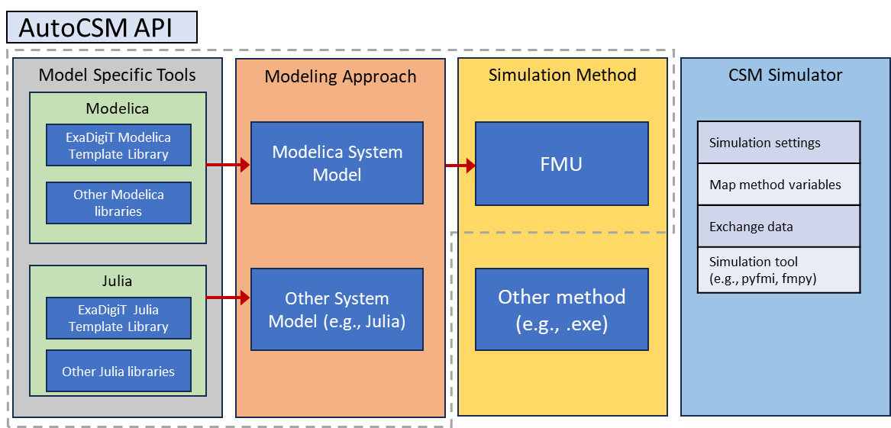
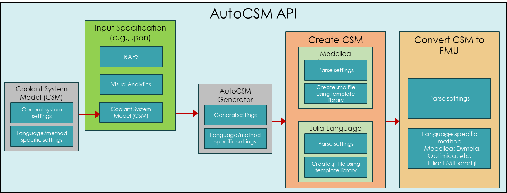

# AutoCSM
 *A template system-of-systems modeling approach for
**AUTO**mating the **C**reation (i.e., development, deployment, and integration) of **S**ystem **M**odels (AutoCSM).*

AutoCSM is a Python-based framework to assist system model developers to accelerate the creation and deployment of SMs through standardized workflows and template modeling architectures. 

Originally developed for systems with deep hierarchies such as as cooling system models for supercomputing facilities within the ExaDigiT digital twin framework. AutoCSM methods and worfklow can be used for any project where a standard architecture can be defined.

As shown in the following figure, AutoCSM is intended to provide a language-agnostic high-level interface to convert system specification information into a containerized system model (e.g., FMU) that can then be consumed by a simulator.

AutoCSM includes three main components: 
- Input specification (JSON): 
- Model generation
- Model export

Below are examples of the structure of AutoCSM within the context of ExaDigiT.

|  | 
|:--:| 
|*AutoCSM API in the broader ExaDigiT procedure.*|

|  | 
|:--:| 
|*Internal to AutoCSM API procedure for ExaDigiT cooling system model creation.*|

## Quick Start
1. Clone the repository.
2. Install dependencies: `pip install numpy matplotlib pandas fmpy`
3. Import the AutoCSM class.
4. (Optional) Create the language-specific architecture.
5. Create the language-specific model.
6. Create the FMU and simulate.

**!! See [examples](./examples/) folders for more details (e.g., [`modelica/run_auto_csm.py`](examples/modelica/run_autocsm.py).**

## Workflow Overview

Each step is independent — you can run only the steps you need. For example, if you already have a Modelica project structure, skip `create_architecture` and start with `create_model`.

```
User JSON spec ──► AutoCSM API ──► Language Method ──► Outputs
                                        │
                    ┌───────────────────┤
                    ▼                   ▼
              create_architecture   create_model
              (folder structure)   (Simulator.mo)
                                        │
                    ┌───────────────────┤
                    ▼                   ▼
              create_setup         create_fmu
              (setup.mos)         (Simulator.fmu)
```

## Requirements
- Python 3+

### For FMU creation

| Dependency | Version | Purpose |
|-----------|---------|---------|
| [Dymola](https://www.3ds.com/products/catia/dymola) | 2023+ | Modelica compiler |
| Dymola Python interface | (bundled with Dymola) | FMU export API |

The Dymola Python interface is typically located at:
`<DYMOLA_INSTALL>/Modelica/Library/python_interface/dymola-VERSION.whl`

Install it with:
```bash
pip install <DYMOLA_INSTALL>/Modelica/Library/python_interface/dymola-VERSION.whl
```

### Implemented languages
- Modelica
    - Dymola
    - OpenModelica (OMEdit) | Not yet supported as awaiting [OMEdit bug fix](https://github.com/OpenModelica/OpenModelica/issues/13065)
- Julia
    - JuliaSim Modeling Language (JSML) | Not yet supported. Awaiting JSML improvements.

### Implemented architectures
- [Nested hierarchy](https://en.wikipedia.org/wiki/Hierarchy#:~:text=A%20nested%20hierarchy%20or%20inclusion,way%20to%20the%20outer%20doll.)

# Advanced:
### Language Method Templates
For each implemented language a library of base templates and classes is requires (see [method](./methods/)). The templates represent the folder structure that will be replicated into the JSON specified layout using the specified architecture (e.g., `nested`). If the default template is not adequate for an application, new templates can be created in the language library and then selected for use from the AutoCSM Python API.

### Architectures
Architecures represent the way the input JSON structure is interpreted and applied to the selected method template. New architectures can be added for any language by adding new methods for the language of interest in Python.

# Citation:

If you use ExaDigiT and/or AutoCSM in your research, please cite our work:

**ExaDigit**:

    @inproceedings{inproceedings,
    title={A Digital Twin Framework for Liquid-cooled Supercomputers as Demonstrated at Exascale}, 
    author={Brewer, Wesley and Maiterth, Matthias and Kumar, Vineet and Wojda, Rafal and Bouknight, Sedrick and Hines, Jesse and Shin, Woong and Greenwood, Scott and Grant, David and Williams, Wesley and Wang, Feiyi},
    booktitle={SC24: International Conference for High Performance Computing, Networking, Storage and Analysis},
    pages={1--18},
    year={2024},
    organization={IEEE}
    }

**AutoCSM**:

    @inproceedings{autocsm,
    title       ={Thermo-fluid Modeling Framework for Supercomputer Digital Twins: Part 2, Automated Cooling Models},
    author      ={Greenwood, S. and Kumar, V. and Brewer, W.},
    booktitle   ={America Modelica Conference},
    pages       ={210--219},
    year        ={2024},
    organization={Modelica Association},
    doi         = {10.3384/ECP207208},
    url         = {https://ecp.ep.liu.se/index.php/modelica/article/view/1146/1053}
    }

**AutoCSM Software**:

    @misc{osti_2446832,
    author       = {Greenwood, Michael Scott and Kumar, Vineet and Brewer, Wesley and USDOE Office of Science},
    title        = {AutoCSM},
    annote       = {A template system-of-systems modeling approach for automating the development, deployment, and  integration of cooling system models (CSMs) for supercomputing facilities within the ExaDigiT framework. AutoCSM is a Python-based framework to assist in CSM developers in accelerating the creation and deployment of system-level thermal-hydraulic CSMs. The intention is for this tool specifically to help standardize digital twin workflows for ExaDigiT. However, this tool can be used independent of ExaDigiT (and even other systems besides CSMs).},
    doi          = {10.11578/dc.20240905.2},
    url          = {https://www.osti.gov/biblio/2446832},
    place        = {United States},
    year         = {2024},
    month        = {09}}

# Authors:
Many thanks to the contributors of ExaDigiT/AutoCSM.\
The full list of contributors and organizations involved are found in CONTRIBUTORS.txt.\
The initial project for ExaDigiT/AutoCSM was created by Scott Greenwood (greenwoodms@ornl.gov).

# License:
ExaDigiT/AutoCSM is distributed under the terms of both the MIT license and the Apache License (Version 2.0).\
Users may choose either license, at their discretion.  

All new contributions must be made under both the MIT and Apache-2.0 licenses.  
See [LICENSE-MIT](./LICENSE-MIT), [LICENSE-APACHE](./LICENSE-APACHE), and [COPYRIGHT](./COPYRIGHT) for details.  

SPDX-License-Identifier: (Apache-2.0 OR MIT)  
